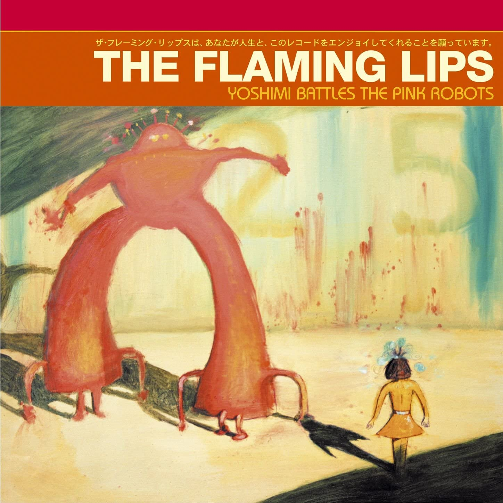
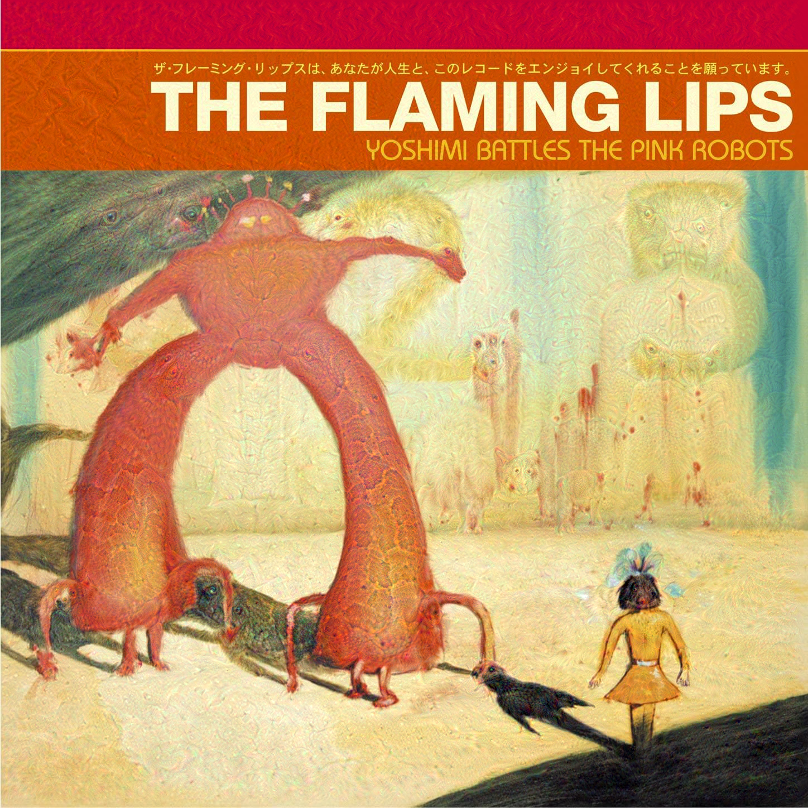

# Dreamify

Let inception_v3 dream about images and see what happens.

Based on a [blog post by Google AI](https://ai.googleblog.com/2015/06/inceptionism-going-deeper-into-neural.html)
and a [notebook by François Chollet](https://colab.research.google.com/drive/18XPdEDVYdr_ODAvW0DrWRCRC25tvTuCE#scrollTo=gP7_g_kB6AsK).

## Requirements:

* numpy
* tensorflow
* tqdm

## Instructions

```
python3 dreamify.py + arguments
```

Arguments:

```
--path (default=""): path to the image to use (provide if no url is provided).
--url (default=""): url of the image to use (provide if no path is provided).
--name (default=""): name of the folder inside Images to store the image retrieved through the url.
--depth (default=3): number of iterations of the dreaming process.
--n_images (default=1): number of outputs.
--seed (default=0): random seed for reproducibility.
--max_coeff (default=10): maximum value for the layer coefficient in the loss function (sampled between 0 and max_coeff).
--max_loss (default=20): maximum loss function value before breaking loop.
```

At each iteration until depth is reached, a random layer is selected for dreaming.

## Result

Originally, this project was about album covers. So, here's an example of the result when the input is Yoshimi Battles the Pink Robots by The Flaming Lips (all settings as default).

Original album cover.


Layer 172 is selected with a coefficient of 5.93.


Then, Layer 192 is selected with a coefficient of 6.03.


Finally, Layer 195 is selected with a coefficient of 8.47.
